```{r setup, include=FALSE}
knitr::opts_chunk$set(echo = FALSE)

library(tidyverse)
library(knitr)

```


---

# Two question pop quiz 

1. Is your lucky (or favorite) number odd or even?
2. How would you describe the value of formative assessment?

### Google Form 

{width=20%}

# Responses?

```{r, echo=FALSE,out.width="49%", out.height="49%", fig.show='hold',fig.align='center'}
knitr::include_graphics(c("OddForm.png","EvenForm.png"))
```

<!-- MDB: Show some actual responses to the survey from past? -->
<!-- MDB: Update Google Form pointer to resource page -->


# Motivation

- Formative assessment intends to support learning; summative assessment intends to measure learning.
- **"Write-to-learn" tasks improve learning outcomes** (Graham, et al., 2020)
- Critical for citizen-statisticians to communicate effectively (Gould, 2010)
- Frequent practice w/ communicating improves statistical literacy and promotes retention (Basu, et al., 2013)
- **Formative assessment benefits both students & instructors** (Black & Wiliam, 2009; GAISE, 2016; Pearl, et al., 2012)


# Easy!

{ width=95% }

# Erm...

{ width=95% }

# Motivation

- "Write-to-learn" tasks improve learning outcomes (Graham, et al., 2020)
- Critical for citizen-statisticians to communicate effectively (Gould, 2010)
- Frequent practice w/ communicating improves statistical literacy and promotes retention (Basu, et al., 2013)
- Formative assessment benefits both students & instructors (Black & Wiliam, 2009; GAISE, 2016; Pearl, et al., 2012)
- A majority of U.S. undergraduates at public institutions take at least one large-enrollment STEM course (Supiano, 2022)
- **Logistics of constructed response tasks jeopardize use in large-enrollment classes** (Garfield & Ben-Zvi, 2008; Woodard & McGowan, 2012)


# Goal


*Develop technology that can assist instructors for large (STEM) classes with providing targeted formative assessment feedback to students, such that instructor burden is similar to small class (~30 students)*

{width=40%}


# Goal {.plain}

\noindent\hspace*{-1cm}\includegraphics[width=\paperwidth]{goal-1-tech.png} 

# Goal {.plain}

\noindent\hspace*{-1cm}\includegraphics[width=\paperwidth]{goal-6-assist.png} 


# Goal {.plain}

\noindent\hspace*{-1cm}\includegraphics[width=\paperwidth]{goal-2-largeClass.png} 


# Goal {.plain}

\noindent\hspace*{-1cm}\includegraphics[width=\paperwidth]{goal-3-formative.png} 


# Goal {.plain}

\noindent\hspace*{-1cm}\includegraphics[width=\paperwidth]{goal-4-targetedFB.png} 


# Goal {.plain}

\noindent\hspace*{-1cm}\includegraphics[width=\paperwidth]{goal-5-burden.png} 


# Back to our example...


```{r, echo=FALSE,out.width="49%", out.height="49%", fig.show='hold',fig.align='center'}
knitr::include_graphics(c("OddForm.png","EvenForm.png"))
```


# Initial Project Schematic

{width=90%}

\vskip 12 pt

\small
*Goal: Computer-assisted formative assessment feedback for short-answer tasks in large-enrollment classes, such that instructor burden is similar to small class (~30 students)*

<!-- Note: Automate the "copy / paste" workflow -->
<!-- Note: How good does the machine have to be?? -->
<!-- Note: as a statistician, I'm always comparing current circumstances of my data to some ideal state (SRS or randomized experiment) and negotiating compromise to achieve most desirable outcomes possible given the circumstances available. It's the same here--we want to create useful FA where there is (almost) none-->


# Research Questions

- **RQ1**: What level of agreement is achieved among trained human raters labeling (i.e., scoring) short-answer tasks?

- **RQ2**: What level of agreement is achieved between human raters and an NLP algorithm?

- **RQ3**: What sort of NLP representation leads to good clustering performance, and how does that interact with the classification algorithm?


\vskip 18pt

### Relevant Papers

\tiny

- Lloyd, S. E., Beckman, M., Pearl, D., Passonneau, R., Li, Z., & Wang, Z. (2022). Foundations for AI-Assisted Formative Assessment Feedback for Short-Answer Tasks in Large-Enrollment Classes. In *Proceedings of the eleventh international conference on teaching statistics*. Rosario, Argentina.

\vskip 6pt

- Beckman, M., Burke, S., Fiochetta, J., Fry, B., Lloyd, S. E., Patterson, L., & Tang, E. (2024). Developing Consistency Among Undergraduate Graders Scoring Open-Ended Statistics Tasks. Preprint URL: <https://arxiv.org/abs/2410.18062>

\vskip 6pt

- Li, Z., Lloyd, S., Beckman, M. D., & Passonneau, R. J. (2023). Answer-state Recurrent Relational Network (AsRRN) for Constructed Response Assessment and Feedback Grouping.  *Findings of the Association for Computational Linguistics: EMNLP 2023*.


# Collaborators

{width=75%}

{width=80%}


<!-- # Methods (Data Set) -->

<!-- Study utilized de-identified extant data & scoring rubrics (Beckman, 2015) -->

<!-- - 6 short-answer tasks -->
<!-- - 1,935 students total -->
<!-- - 29 class sections 15 distinct institutions -->


<!-- Note: this sample was *not* a single large class at one institution; these data include introductory statistics students from many class sections at many institutions--some large, others small. -->

<!-- { width=25% } -->


# Methods (Short-answer task)


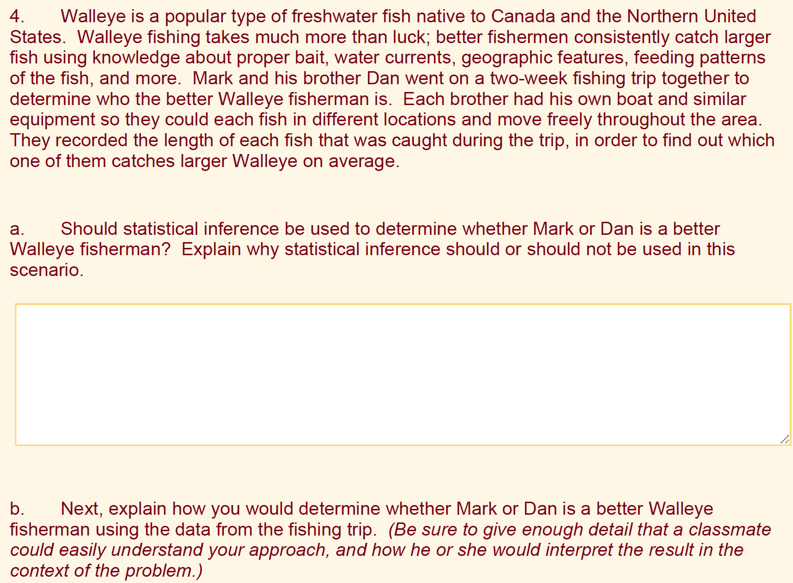{width=90%}

# Methods (RQ1)

**RQ1**: What level of agreement is achieved among trained human raters labeling (i.e., scoring) short-answer tasks?

<!-- - constraint: *intra-rater* analysis for person that had labeled 178 responses ~7 years prior -->

- Lloyd et al., (2022)
    - 3 raters typical of large-enrollment instruction team
    - (6 tasks) x (1,935 students) distributed among the team
    - sufficient intersection to assess inter-rater agreement
    - responses judged Correct / Partial / Incorrect against rubric
- Beckman at al., (2024)
    - 4 Undergraduate Teaching Assistants (UTAs) and 1 instructor
    - (4 tasks) x (63 students) scored by each UTA + Instructor
    - 5 sequential exercises associated with progression of scoring development


# Results

- "short-answer" tasks are good for students, but hard to scale
- Can NLP tools help instructors give students feedback?
    - Evaluate & group student responses
    - Compare agreement between NLP & humans
    - Evaluate scalable, personalized feedback solutions

### Scoreboard[^1]

\small

- (RQ1) Instructor agreement ($\text{QWK} \approx 0.7 \text{ to } 0.8+$)  
- (RQ1) UTA agreement ($\text{QWK} \approx 0.6 \text{ to } 0.7+$)  
- **What about... NLP algorithm & instructor agreement?**  
 
<!-- - NLP algorithm agreement with instructors ($\text{QWK} \approx 0.7+$) -->
<!-- - Human-Algorithm partnership may be even better? ($\approx 0.85+$) -->
<!-- - Pursuing multiple avenues for grouping & feedback -->


[^1]: Lloyd, et al. (2022); Beckman, et al. (2024)


# Methods (RQ2)

**RQ2**: What level of agreement is achieved between human raters and an NLP algorithm?


{width=95%}


### Paper introducing SFRN

\tiny

Li, Z., Tomar, Y., & Passonneau, R. J. (2021). A Semantic Feature-Wise Transformation Relation Network for Automatic Short Answer Grading. In *Proceedings of the 2021 Conference on Empirical Methods in Natural Language Processing*, pp. 6030–6040. Association for Computational Linguistics. <https://aclanthology.org/2021.emnlp-main.487>


# Meet the "machine": NLP for Assessment

- Natural language processing (NLP) involves how computers can be programmed to analyze language elements
- NLP-assisted feedback for educational use:
    - automated short-answer grading (ASAG) from 2009
    - essays & long-answer tasks earlier
- Human-machine collaboration is a promising mechanism to assist rapid, individualized feedback at scale (Basu, 2013)
- Deep neural networks application since 2016
- Relational (neural) networks


# Meet the "machine": Relational Networks

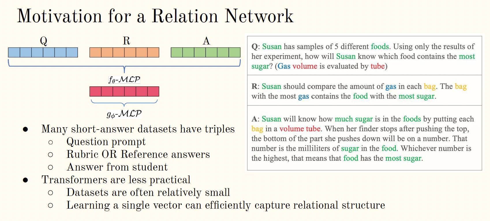

- much of the architecture inspired by work from computer vision
- more efficient than transformer networks (e.g., LLMs)


# Meet the "machine": SFRN Schematic

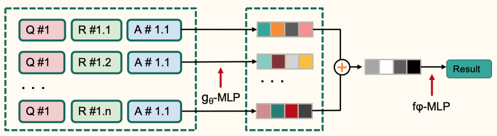{width=70%}

Semantic Feature-Wise Transformation Relation Network (SFRN):

- end-to-end model with three components:
    - ($g_{\theta}MLP$) pretrained BERT encoder (LLM) >> vector representations
    - (+) learned feature-wise transformation function fuses multiple representations, if necessary (e.g., multiple reference answers)
    - ($f_{\phi}MLP$) is a classifier algorithm, i.e., neural network
- relation networks designed to learn generalizations that infer meaning in a data-efficient way
- data augmentation during training step


<!-- The set of task-responses were randomly split four ways:   -->

<!-- - 90% of data for development purposes (training) -->
<!--     - training (72%),  -->
<!--     - development (9%)  -->
<!--     - evaluation (9%) -->
<!-- - 10% of data held in reserve (test) -->


# Results

- "short-answer" tasks are good for students, but hard to scale
- Can NLP tools help instructors give students feedback?
    - Evaluate & group student responses
    - Compare agreement between NLP & humans
    - Evaluate scalable, personalized feedback solutions

### Scoreboard[^1]

\small


- (RQ1) Instructor agreement ($\text{QWK} \approx 0.7 \text{ to } 0.8+$)  
- (RQ1) UTA agreement ($\text{QWK} \approx 0.6 \text{ to } 0.7+$)  
- (RQ2) NLP algorithm & instructor agreement ($\text{QWK} \approx 0.7+$)  
- **What if we combine the Human & Machine??**  

<!-- - Human-Algorithm partnership may be even better? ($\approx 0.85+$) -->
<!-- - Pursuing multiple avenues for grouping & feedback -->


# Human-Machine Combination?

{ width=90% }

<!-- # Human-Machine Partnership? -->

<!-- { width=90% } -->

# Human-Machine Partnership?

{ width=80% }

# Human-Machine Partnership?

Our approach to human-in-the-loop (HIL) did **not** make a recommendation (e.g., Left), it just shows examples to the human when it needs help (e.g., Right).


```{r, echo=FALSE,out.width="49%", out.height="49%", fig.cap="Illustration adapted from Google Photos", fig.show='hold',fig.align='center'}
knitr::include_graphics(c("GooglePhotos.png","GooglePhotoDeferral.png"))
```


# Human-Machine Partnership Method

Want to evaluate accuracy of marking algorithm when designed to "defer" to human judgment

- algorithm evaluates a probability for each label (EC, PC, IC)
    - if a label has high probability, use algorithm label
    - if no label has sufficiently high probability, defer to human
- interests
    - estimate how frequently the algorithm defers
    - estimate accuracy of the combined process


# Human-Machine Partnership Results

> Our work is first that we know of to impelement controllable, selective prediction deferral policy for the classifier (i.e., scoring) step.

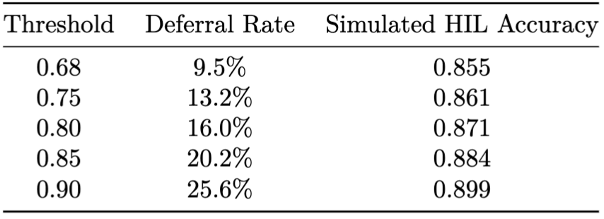{width=80%}

<!-- | Threshold     | Deferral Rate  |  Simulated HIL Accuracy | -->
<!-- |:-------------:|:--------------:|:------------------:| -->
<!-- | 0.68          |  0.095         | 0.855            | -->
<!-- | 0.75          |  0.132         | 0.861            | -->
<!-- | 0.80          |  0.160         | 0.871            | -->
<!-- | 0.85          |  0.202         | 0.884            | -->
<!-- | 0.90          |  0.256         | 0.899            | -->

<!-- | 0.95          |  0.418         | 0.931            | -->

<!-- 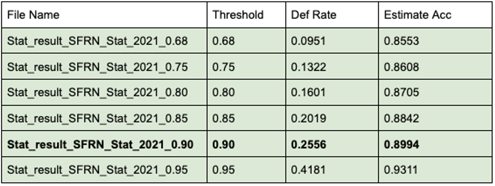 -->


# Results

- "short-answer" tasks are good for students, but hard to scale
- Can NLP tools help instructors give students feedback?
    - Evaluate & group student responses
    - Compare agreement between NLP & humans
    - Evaluate scalable, personalized feedback solutions

### Scoreboard[^2]

\small


- (RQ1) Instructor agreement ($\text{QWK} \approx 0.7 \text{ to } 0.8+$)  
- (RQ1) UTA agreement ($\text{QWK} \approx 0.6 \text{ to } 0.7+$)  
- (RQ2) NLP algorithm agreement with instructors ($\text{QWK} \approx 0.7+$)  
- (RQ2) Human-Algorithm partnership may be even better? ($\approx 0.85+$)  
- **Can we cluster responses & provide feedback?**  


[^2]: Li, et al., (2023)


# Methods (RQ3)

**RQ3**: What sort of NLP representation leads to good clustering performance, and how does that interact with the classification algorithm?

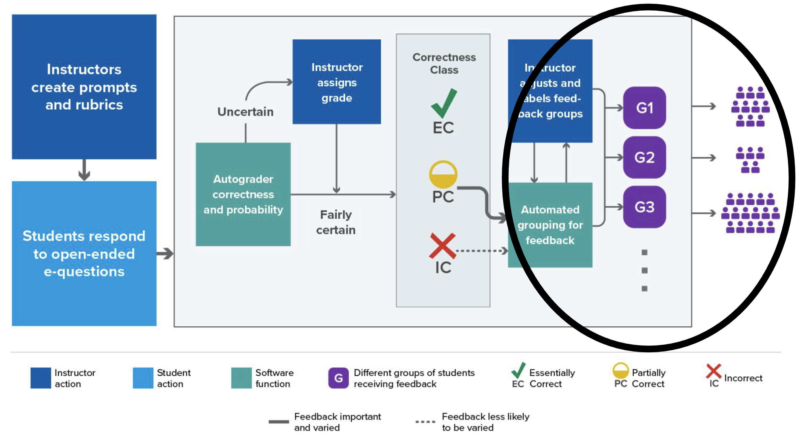{ width=95% }

<!-- Notes: reasonable first attempt to study the way instructors might do it and build tools to streamline at scale -->


<!-- # Let's talk about Feedback... -->

<!-- *Develop technology that can assist instructors for large (STEM) classes with providing targeted formative assessment feedback to students, such that instructor burden is similar to small class (~30 students)* -->

<!-- { width=95% } -->


# Feedback Avenues 

- Just let AI do it?
- Classifier / Clustering Tools?
- Topological Data Analysis Tools?
- Something completely different?


# Feedback: Just let AI do it

- undermines instructor benefits of formative assessment
- conflicts with goal statement (e.g., amplify, not supplant, instructor effort)
- additional concerns...


# {.plain}

<!-- \noindent\hspace*{-1cm}\includegraphics[width=\paperwidth]{terminator.png}  -->


{ width=100% }


# Feedback: Just let AI do it?[^3]

- undermines instructor benefits of formative assessment
- conflicts with goal statement (e.g., amplify, not supplant, instructor effort)
- Our work has found AI to be less than optimal anyway (Wei et al., in review)
- Also,

\small 

U.S. Department of Education, Office of Educational Technology (2023). *Artificial Intelligence and Future of Teaching and Learning: Insights and Recommendations*, Washington, DC. 

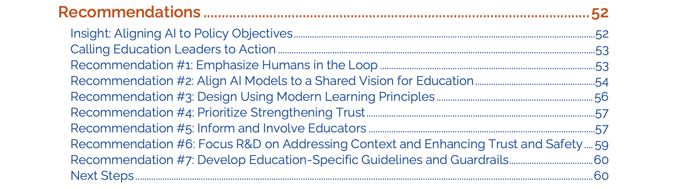{ width=80% }


[^3]: Wei, Beckman, Pearl, & Passonneau (in review). Concept-based Rubrics Improve LLM Formative Assessment and Data Synthesis.

# Feedback Avenues 

- ~~Just let AI do it~~  
- Classifier / Clustering Tools?   
- Topological Data Analysis Tools?  
- Guided Reflection? 


# Feedback: Classifier / Clustering Tools

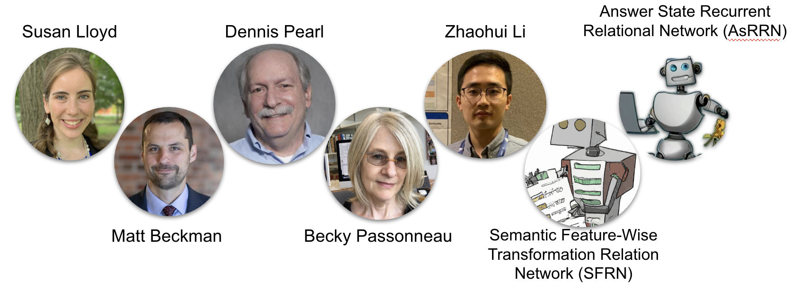{ width=95% }

**RQ3**: What sort of NLP representation leads to good clustering performance, and how does that interact with the classification algorithm?


- Method: Rinse & repeat! 
    - Study the way instructors might do it and build tools to streamline at scale
    - How consistent are humans?
    - Can our NLP tools achieve results as good or better than humans?
- Result: Respectable (...in spite of the *curse*)


# Feedback: Topological Data Analysis Tools

{ width=80% }

- Dimension 0 TDA is akin to cluster analysis
- Dimension 1 introduces "holes" 
- Higher dimensions (e.g., voids) possible
- **Results:**
    - Ongoing work
    - Promising work for NLP application of TDA, broadly
    - Viability for feedback is still a long road


# Feedback: Guided Reflection with Comparative Judgment

\begin{columns}
  \begin{column}{0.45\textwidth}
    \includegraphics[width=\linewidth]{cj-schematic.png}
  \end{column}
  \begin{column}{0.55\textwidth}
    \includegraphics[width=\linewidth]{FB-team-cj.png}
    \begin{itemize}
      \item Capture all student responses
      \item Review set of peer responses
      \item Rank most to least developed
      \item Write peer feedback
      \item (repeat for a few sets)
      \item Review peer feedback to \textbf{you}
      \item Update your initial response?
    \end{itemize}
  \end{column}
\end{columns}

# Results

- "short-answer" tasks are good for students, but hard to scale
- Can NLP tools help instructors give students feedback?
    - Evaluate & group student responses
    - Compare agreement between NLP & humans
    - Evaluate scalable, personalized feedback solutions

### Scoreboard (Final)

\small


- (RQ1) Instructor agreement ($\text{QWK} \approx 0.7 \text{ to } 0.8+$)  
- (RQ1) UTA agreement ($\text{QWK} \approx 0.6 \text{ to } 0.7+$)  
- (RQ2) NLP algorithm agreement with instructors ($\text{QWK} \approx 0.7+$)  
- (RQ2) Human-Algorithm partnership may be even better? ($\approx 0.85+$)  
- (RQ3) Clustering performance? (one of several avenues to pursue)  


# Discussion

- **RQ1**: Substantial agreement achieved among trained human raters provides context for further comparisons

- **RQ2**: NLP algorithm produced agreement reasonably aligned to results achieved by pairs/groups of trained human raters
    - Human-in-the-Loop >> Instructor / Algorithm partnership

- **RQ3**: Promising results based on "man-made clusters" but classification and clustering have competing incentives when it comes to dimensionality of NLP vector representations
    - Lower Dim is generally better for cluster stability
    - Higher Dim better for classification reliability
    - Feedback as a classifier (Li et al., 2023)
    - Exploring Topological Analysis as alternative to clustering
    - Comparative judgments for guided reflection as feedback


# Current Events

- challenge system with diverse tasks, institutions, student populations;
    - partnering with ISU, MSU, PSU, UCSB, UF, UTEP, & UoA
    - both "consensus" tasks & "local" tasks
    - approx 44,000 responses from ~ 13,000 students
    - targeting languistic diversity
- accumulated data to be shared with broader NLP community
    - this will be among the largest *open* data sources of it's kind
    - addresses barriers imposed by proprietary data sources on NLP research
- algorithm development 
    - contrastive loss function
    - accommodates more complex task structure
    - impact of response length 
    - studying influence of rubric features (Wei et al, in review)
- Studying comparative judgments for guided reflection as feedback


# Acknowledgments

- US National Science Foundation (NSF DUE-2236150: Project CLASSIFIES)
- Penn State Center for Socially Responsible Artificial Intelligence
- Strategic partnership between University of Auckland and Penn State University
- Thanks to students and faculty at partner institutions that have assisted us with data collection.


# References (1/3)

\tiny

#. Basu, S., Jacobs, C., & Vanderwende, L. (2013). Powergrading: a Clustering Approach to Amplify Human Effort for Short Answer Grading. *Transactions of the Association for Computational Linguistics, 1*, 391–402. <https://doi.org/10.1162/tacl_a_00236>

#. Beckman, M. (2015). Assessment Of Cognitive Transfer Outcomes For Students Of Introductory Statistics. <http://conservancy.umn.edu/handle/11299/175709>

#. Beckman, M., Burke, S., Fiochetta, J., Fry, B., Lloyd, S. E., Patterson, L., & Tang, E. (2024). Developing Consistency Among Undergraduate Graders Scoring Open-Ended Statistics Tasks. Preprint URL: <https://arxiv.org/abs/2410.18062>

#. Black, P., & Wiliam, D. (2009). Developing the theory of formative assessment.  *Educational Assessment, Evaluation and Accountability, 21,* pp 5-31. <https://doi.org/10.1007/s11092-008-9068-5>

#. GAISE College Report ASA Revision Committee (2016). Guidelines for Assessment and Instruction in Statistics Education College Report 2016. URL: <http://www.amstat.org/education/gaise>

#. Gould, R. (2010). Statistics and the Modern Student. *International Statistical Review / Revue Internationale de Statistique, 78*(2), 297–315. <https://www.jstor.org/stable/27919839>

# References (2/3)

\tiny


7. Guo, W., Diab, M. (2012) Modeling Sentences in the Latent Space. In *Proceedings of the 50th Annual Meeting of the Association for Computational Linguistics*, pages 864–872. Association for Computational Linguistics.

#. Graham, S., Kiuhara, S. A., & MacKay, M. (2020). The Effects of Writing on Learning in Science, Social Studies, and Mathematics: A Meta-Analysis. *Review of Educational Research, 90*(2), 179–226.

#. Gwet, K. (2014). Handbook of Inter-Rater Reliability: The Definitive Guide to Measuring the Extent of Agreement Among Raters

#. Li, Z., Tomar, Y., & Passonneau, R. J. (2021). A Semantic Feature-Wise Transformation Relation Network for Automatic Short Answer Grading. In *Proceedings of the 2021 Conference on Empirical Methods in Natural Language Processing*, pp. 6030–6040. Association for Computational Linguistics. <https://aclanthology.org/2021.emnlp-main.487>

#. Li, Z., Lloyd, S., Beckman, M. D., & Passonneau, R. J. (2023). Answer-state Recurrent Relational Network (AsRRN) for Constructed Response Assessment and Feedback Grouping.  *Findings of the Association for Computational Linguistics: EMNLP 2023*. <https://doi.org/10.18653/v1/2023.findings-emnlp.254>

#. Lloyd, S. E., Beckman, M., Pearl, D., Passonneau, R., Li, Z., & Wang, Z. (2022). Foundations for AI-Assisted Formative Assessment Feedback for Short-Answer Tasks in Large-Enrollment Classes. In *Proceedings of the eleventh international conference on teaching statistics*. Rosario, Argentina.

# References (3/3)

\tiny


<!-- #. Page, E. B. (1994). Computer Grading of Student Prose, Using Modern Concepts and Software. *The Journal of Experimental Education, 62*(2), 127–142. -->

13. Pearl, D. K., Garfield, J. B., delMas, R., Groth, R. E., Kaplan, J. J., McGowan, H., & Lee, H. S. (2012). Connecting Research to Practice in a Culture of Assessment for Introductory College-level Statistics. URL: <http://www.causeweb.org/research/guidelines/ResearchReport_Dec_2012.pdf>

#. U.S. Department of Education, Office of Educational Technology (2023). Artificial Intelligence and Future of Teaching and Learning: Insights and Recommendations, Washington, DC.

#. Viera, A. J., & Garrett, J. M. (2005). Understanding interobserver agreement: the kappa statistic. *Family Medicine, 37*(5), 360–363.

#. Woodard, R., & McGowan, H. (2012). Redesigning a large introductory course to incorporate the GAISE guidelines. *Journal of Statistics Education, 20*(3).


# Thank You


\titlepage


Resource Page: https://mdbeckmantemp.github.io/NZSA-Seminar/


# Supporting Slides


# SFRN Detail (Li et al., 2021)

\small

SFRN is an end-to-end model with 3 components:

1. encode QRA triples producing vector representations for question (Q), a possible reference (R), and student answer (A)
2. when relation network includes multiple QRA triples, a learned feature-wise transformation network merges all relation vectors for a student answer into a single relation vector by leveraging attentions calculated by a QRA triple;
3. the resulting vector representation is passed as an input to a classifier (i.e., neural network)

![The $g_{\theta}MLP$ function (Left) uses an encoder to compute the relation vector for each [Q,R,A] triple. A
set of relation vectors is combined (+) using a fusion function (*SFT*). The $f_{\phi}MLP$ function is the classifier step.](SFRN.png){width=70%}


# Results: Instructors as Graders

**RQ1**: What level of agreement is achieved among trained human raters labeling (i.e., scoring) short-answer tasks?

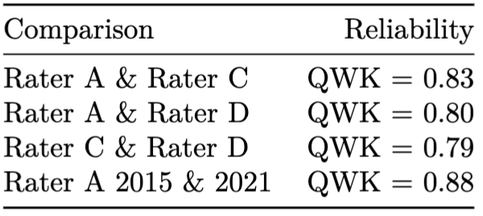{height=25%}


\vskip 32 pt

\footnotesize

Reliability intuition[^6]: moderate < 0.6 < substantial < 0.8 < near perfect < 1.0

[^6]: Viera & Garret (2005)

# Results: Instructor and UTA Graders

**RQ1**: What level of agreement is achieved among trained human raters labeling (i.e., scoring) short-answer tasks?


{width=95%}


<!-- | Comparison        |  Day 1      | Day 5        | Week 10     | -->
<!-- |:------------------|------------:|-------------:|------------:| -->
<!-- | Rater A & Rater E |  QWK = 0.46 |  QWK = 0.57* |  QWK = 0.58 | -->
<!-- | Rater A & Rater F |  QWK = 0.61 |  QWK = 0.72* |  QWK = 0.78 | -->
<!-- | Rater A & Rater G |  QWK = 0.63 |  QWK = 0.73* |  QWK = 0.73 | -->
<!-- | Rater A & Rater H |  QWK = 0.72 |  QWK = 0.71  |  QWK = 0.68 | -->


\vskip 32 pt

\footnotesize

Reliability intuition: moderate < 0.6 < substantial < 0.8 < near perfect < 1.0


# Results: Instructor & UTA (cont'd)

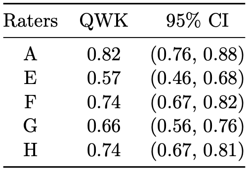{ width=30% }

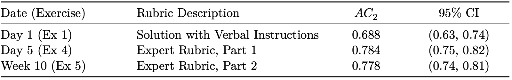{ width=100% }


# Results (RQ2)


**RQ2**: What level of agreement is achieved between instructors and the machine (an NLP algorithm)?


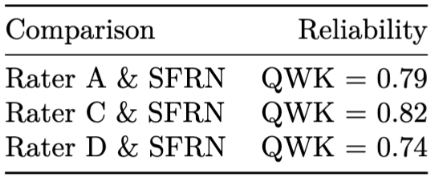{width=60%}

<!-- | Comparison     | Reliability | -->
<!-- |:---------------|------------:| -->
<!-- | Rater A & SFRN |  QWK = 0.79 | -->
<!-- | Rater C & SFRN |  QWK = 0.82 | -->
<!-- | Rater D & SFRN |  QWK = 0.74 | -->
<!-- | Raters: A, C, D, & SFRN |  FK = 0.68 | -->


\vskip 32 pt

\footnotesize

Reliability intuition: moderate < 0.6 < substantial < 0.8 < near perfect < 1.0


# Methods (RQ3): Humans

How similar is feedback provided by two instructors for some group of students?

- Two instructors independently evaluated 100 "partial credit" responses
- Each instructor provided free-text feedback to each student
- Verbatim feedback captured for each instructor and cross-tabulated for analysis.
- *Results:* 
    - The two instructors gave substantially equivalent feedback to 66 of 100 responses
    - Evidence of two large "clusters" (and quite a few singletons)


# Methods (RQ3): Machines

- Experiment #1 
    - retrain k-means & k-mediods clustering & evaluate stability
    - compare representations with higher & lower dimensionality
    - **Results:** 
        - SFRN (D = 512): cluster stability 0.62
        - Highest stability among competing algorithms was 0.88, achieved using a matrix factorization method that produces static representations (D = 50; WTMF; Guo & Diab, 2011)
        - *cursed*


- Experiment #2: 
    - ~~clustering~~ => FB Classifier?
    - Both Humans & Machines attempt
    - **Results:**
        - NLP Algorithm was more consistent with instructor A on one task and instructor B on the other task tested.
        - *meh*


# Results (RQ3 humans)

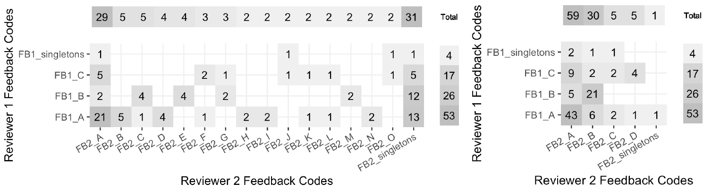{width=95%}

- Reviewer 1 favored feedback on statistical concepts (only).
- Reviewer 2 provided same, plus a quote from the student
- Reviewer 2 parsed feedback to compare remarks related to the statistical concepts (only) with that of Reviewer 1.

# Results (RQ3 humans)

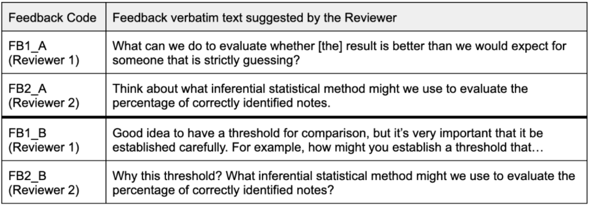{ width=95% }


# Results (RQ3 machines)

**RQ3**: What sort of NLP representation leads to good clustering performance, and how does that interact with the classification algorithm?

- SFRN (D = 512) produced reasonably consistent clusters when retrained (0.62)
- Highest consistency (0.88; D = 50) was achieved using a matrix factorization method that produces static representations (WTMF; Guo & Diab, 2011)

- AsRRN compared to humans (A & B) grouping students by pre-determined feedback categories:

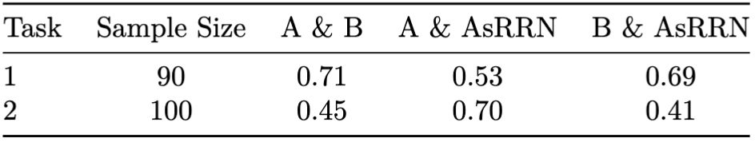

<!-- | Task | Sample Size | A & B  | A & AsRRN | B & AsRRN | -->
<!-- |:-----|:-----------:|:------:|:---------:|:---------:| -->
<!-- | 1    |  90         | 0.71   |   0.53    |   0.69    | -->
<!-- | 2    |  100        | 0.45   |   0.70    |   0.41    | -->


